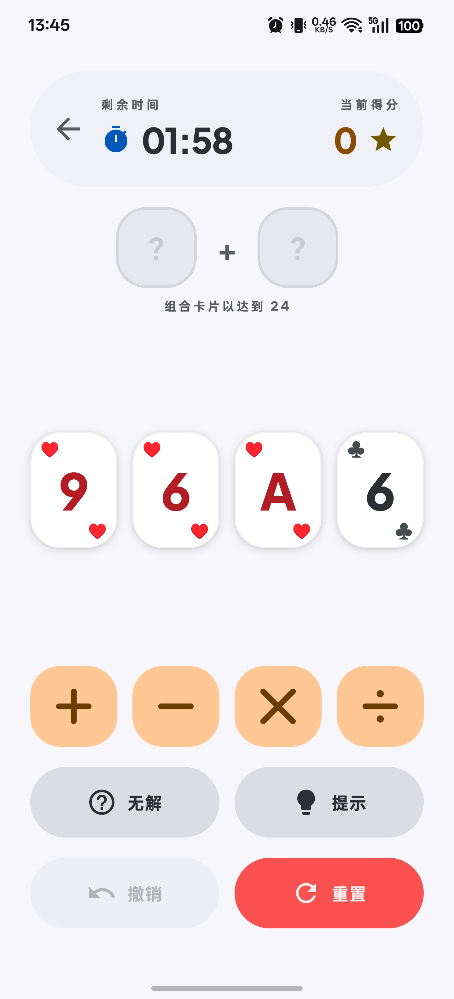
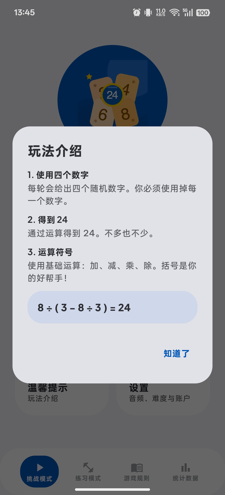
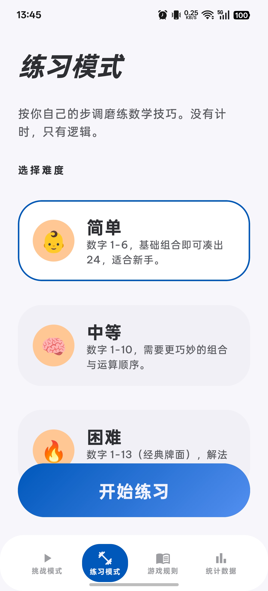
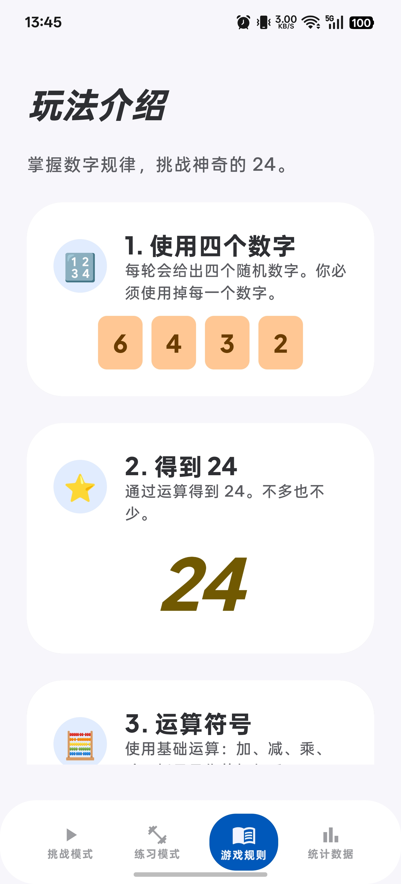
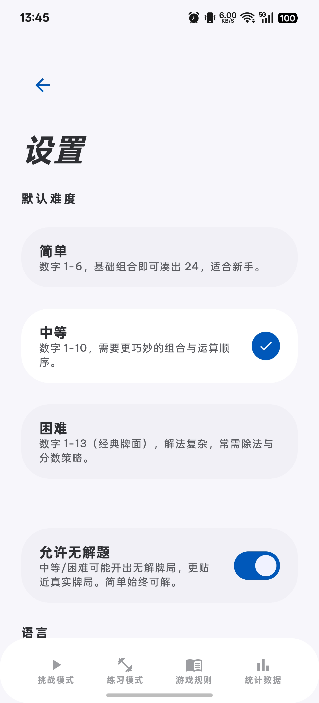
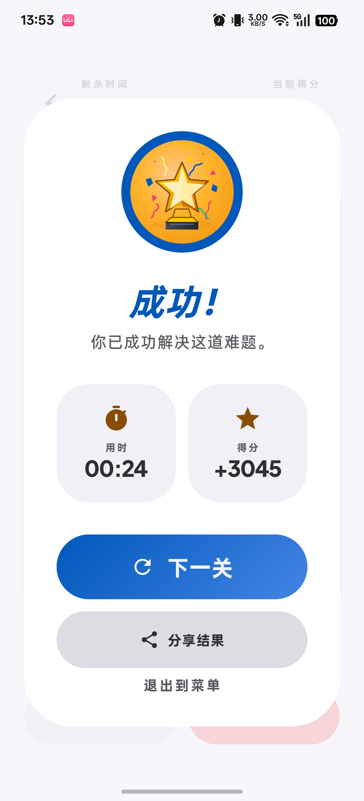
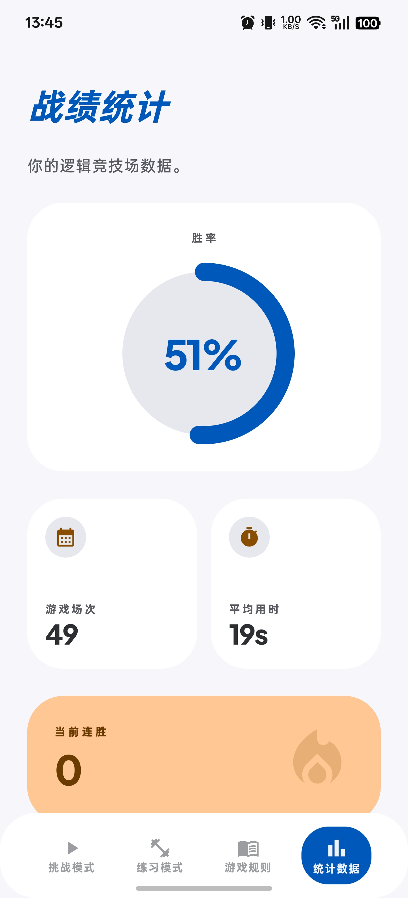
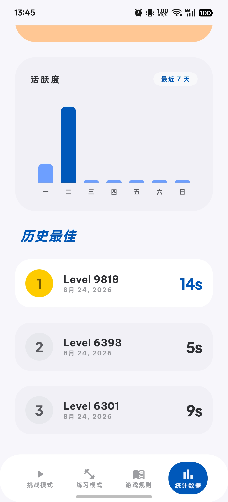

# 24 点挑战（24 Solve）

一个基于 **Jetpack Compose** 的 24 点数学游戏 Android 应用，配套一套**跨平台（Kotlin Multiplatform）24 点精确求解算法**。通过 `+ - × ÷` 与任意括号把 4 张牌凑成 24，支持三档难度、无解题配置、实时提示/无解判定与丰富的计分机制。

> 求解算法（纯 Kotlin，可嵌入任意 Compose Multiplatform 项目）见 [`solver/README.md`](solver/README.md)。

## 运行截图

| 首页 | 挑战解题 | 提示与无解 |
|---|---|---|
|  |  |  |

| 练习模式 | 游戏规则 | 设置 |
|---|---|---|
|  |  |  |

| 结算成功 | 数据分析 | 数据分析·活动 |
|---|---|---|
|  |  |  |

## 功能特性

- **三档难度阶梯**：简单（数字 1–6，恒可解）/ 中等（1–10）/ 困难（1–13 经典牌面）
- **可配置"允许无解题"**（设置开关）：开启后中高难度随机发牌可能无解，贴近真实牌局；简单难度始终可解
- **求解器驱动**：
  - **提示**：按当前剩余牌数（4/3/2 张）给出精确解法；当前局面无解时给出"无解"回答
  - **无解按钮**：仅回答开局是否无解（答错扣 300 分 + 15 秒，防免费试探）；正确识别无解视为过关胜利
  - 简单难度合并前预校验，杜绝无解死局
- **计分机制**：
  - 难度系数：简单 ×1 / 中等 ×1.5 / 困难 ×2
  - 时间奖励（剩余秒数 ×5）、步数奖励（完美 3 步 +300）、连胜加成（连胜 ×100）
  - **连续通关累计得分与用时**，鼓励连续解答
- **历史最佳（Top 3）**：按累计得分 + 累计用时排序
- **数据分析**：胜率、总局数、平均用时、当前连胜、最近 7 天活跃度（每次进入自动刷新）
- **设置**：中英文切换、默认难度、允许无解题
- **结算定制图标**：成功 = 金色奖杯勋章，失败 = 裂星标记
- **体验细节**：底部导航 + 系统返回键、退出/重置防误触确认、卡牌分数（分子/分母）显示、应用图标与首页品牌图

## 项目结构

```
.
├── android/                  # Android 应用（多模块）
│   ├── app/                  # Compose UI（导航/游戏/统计/设置/规则）
│   ├── core/                 # 领域模型、游戏逻辑、求解器（com.make24.solver）
│   └── data/                 # Room 数据库、DataStore 设置、仓库层
├── solver/                   # 独立 24 点求解算法（纯 Kotlin，KMP 通用）
├── screen/                   # 应用运行截图
└── 24point-*.svg             # 应用图标/结算图标源文件
```

## 技术栈

| 模块 | 技术 |
|---|---|
| UI | Jetpack Compose（Material3）、Navigation Compose、Vico 图表 |
| 架构 | MVVM + Hilt 依赖注入、MVI（StateFlow） |
| 数据 | Room、DataStore（Preferences） |
| 算法 | 纯 Kotlin 24 点求解器：`Long` 精确分数标准路径、自研 `BigNum` 任意精度 fallback、1820 组合 LUT、`solveThree`/`solveTwo` 渐进提示 |

## 构建与运行

```bash
cd android
./gradlew :app:assembleDebug          # Debug APK
./gradlew :app:assembleRelease        # Release APK（R8 压缩 + debug 签名）
```

- 需要 JDK 17+（推荐 21）、Android SDK（compileSdk 35）
- 打版本标签 `v*` 推送后，GitHub Actions 自动构建并发布 Release（`.github/workflows/release.yml`）

## 测试

```bash
cd android
./gradlew :core:testDebugUnitTest      # core 单元测试（游戏逻辑/模型）
```

求解算法测试（1820 组合一致性、100k 属性测试、并发、BigNum 对照）见 [`solver/README.md`](solver/README.md)。

## 版本历史

| 版本 | 说明 |
|---|---|
| 1.0.1（versionCode 2） | 求解器集成（提示/无解/防死局）、无解配置、计分增强与连胜累计、统计实时刷新、UI 优化与防误触 |
| 1.0.0（versionCode 1） | 首版：三档难度、练习模式、统计、设置、结算与图表 |

## 免责声明

- 应用签名当前使用 debug 密钥（便于自动发布安装），正式上架请配置正式 keystore。
- `screen/` 截图仅供文档展示，实际界面以真机为准。
